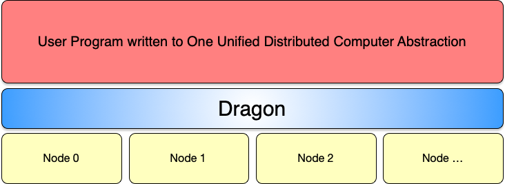

# Welcome to Dragon Tutorials

Welcome! The purpose of this site is to provide tutorials and how-tos related to Dragon. Discussions on this site are also open to you to ask questions, suggest topics, and offer your own experiences with Dragon! No questions are bad questions as long as they are asked sincerely. Please don't hesitate to speak up if you have questions.

Dragon is unlike most libraries in that it is designed not to replace anything, but to make everything work better together and to remove the burden of rolling your own internode communication and synchronization when writing parallel programs in a distributed computing environment.



Conceptually, Dragon provides you with a unified view of your distributed computation. The same version of Dragon runs on your laptop and on supercomputers. The same version of your program can run on a supercomputer and your laptop (though at a much smaller scale, of course)! You can also optimize your program to run the best on your particular hardware. Dragon is very flexible and is a great way to prototype a solution. It then allows you to optimize the heck out of it once you have something running.

Dragon is a composable, distributed runtime that enables users to create sophisticated, scalable, resilient, and high-performance AI/HPC applications, workflows, and services via Python, C, C++, and potentially anything that can be built and executed in one of those three environments.

Dragon provides a run-time that manages off-node communication using a design that is exactly the same for on-node communication. The only difference to your program between on-node communication and off-node communication is a performance
difference since off-node communication occurs over a high-speed network and on-node communication utilizes shared memory between processes. The cost of scaling past what a node can handle is off-node communication, and Dragon handles all this for you in a very efficient manner using a transport agent to do the data movement between nodes.

When you start a Dragon program, you run the `dragon` command which brings up the Dragon runtime and executes your program. Running a Dragon
program looks like this.

```bash
    dragon prog.py
```

Where prog.py is a Python program or executable. Most of the time you would start your program via a Python program. The `dragon` command brings up the Dragon run-time on all your nodes, ties them all together using Dragon transport agents, and starts your program on one of the nodes. That program can then expand to all the nodes on your distributed computer by starting other processes as part of its parallel program.


While your program gets started on a particular node by Dragon, it still conceptually has access to all the nodes of the distributed computer using what is called Python multiprocessing or by using Dragon APIs which all operate exactly the same whether your application is running single node or multinode.

Global Services is part of the Dragon run-time that manages resources that may be shared amongst all nodes of the cluster or supercomputer. Global Services employs Local Services to do the managing of resources that are specific to a node in the cluster. Local Services does
local parts of process management and the management of shared memory pools and what are called channels, a low-leve communication and synchronization object in Dragon.

The purpose of this site then is to get you up and running Dragon and writing Dragon programs as quickly as possible. And, it will introduce you to a lot of what Dragon can do by providing you with tutorials and examples. The first tutorials show you how to set up a development environment in which you can write Dragon programs. After that we'll dive deeper into Dragon. Each tutorial will also provide an `In Depth` section that will further explain how it all works to give interested readers a better understanding of Dragon from top to bottom.

For complete Dragon documentation, please see http://dragonhpc.org. Our main documentation site contains API documentation, additional examples, links to the Dragon source code repository, and other discussions.

# Tutorials

Here are links to tutorials provided on this site. If you have questions, please feel free to post on the discussions here. In addition, you might choose to add the Slack workspace at http://dragonhpc.slack.com where we have a growing community of users and questions and answers get regularly posted. The only drawback is that the Slack postings age out after 90 days. The discussions on this GitHub site will not age out.

These tutorials will get added to regularly.

* [Getting Started with Dragon](/gettingstarted/README.md)
* [Running a Jupyter Notebook in Dragon](/jupyter/README.md)

# A Little History

Dragon started as an innovation project at Cray Supercomputing in 2019. Cray was purchased by HPE later that year and Dragon was given the chance to grow and mature under HPE management. Dragon is still actively being developed today, but has also reached a level of maturity where it is being used in both Scientific and Commercial applications. The original motivation for Dragon was several-fold.

* Create a scalable version of Python for supercomputing.
* Provide a multinode implementation of Python multiprocessing as an easy on-ramp
* Provide multi-node support for existing multiprocessing applications and libraries.
* Provide cross-language support not just for Python, but also for C, C++, and possibly other languages.
* Solve, once and for all, the problem of multi-node communication and synchronization in multi-stage, dynamic workflows that prior to Dragon was being solved over and over again by every group that wrote such applications.

That last bullet was important in bringing supercomputing to where it is today where workflows are becoming multi-stage and dynamic to a much larger degree with the advent of AI training and inference. Dragon solves the synchronization and communication problem in a scalable fashion and does it better than past frameworks have been able to do. In short, Dragon was originally designed to solve these problems. It was not repurposed from some other earlier project. This distinct and thoughtful design of Dragon means it has unmatched performance and capabilities in the world of supercomputing.

# The Team

Dragon has been implemented by a small, highly skilled team of architects and programmers. Numbering around a dozen, the team includes experts with experience from the areas of traditional supercomputing, MPI and scientific libraries, Data Science and AI, and Computer Science. The varied backgrounds of the members of the team has contributed to a robust design and implementation of many fundamental, core features and unique vertical uses of Dragon that address specific application areas.

It is because our team works so well together that we have been able to move quickly while also moving toward a very stable base on which applications using Dragon are being developed. We hope you might be interested in using Dragon as well!

[Members of the Dragon team can be found here](https://github.com/DragonHPC/dragon/blob/main/README.md#credits).