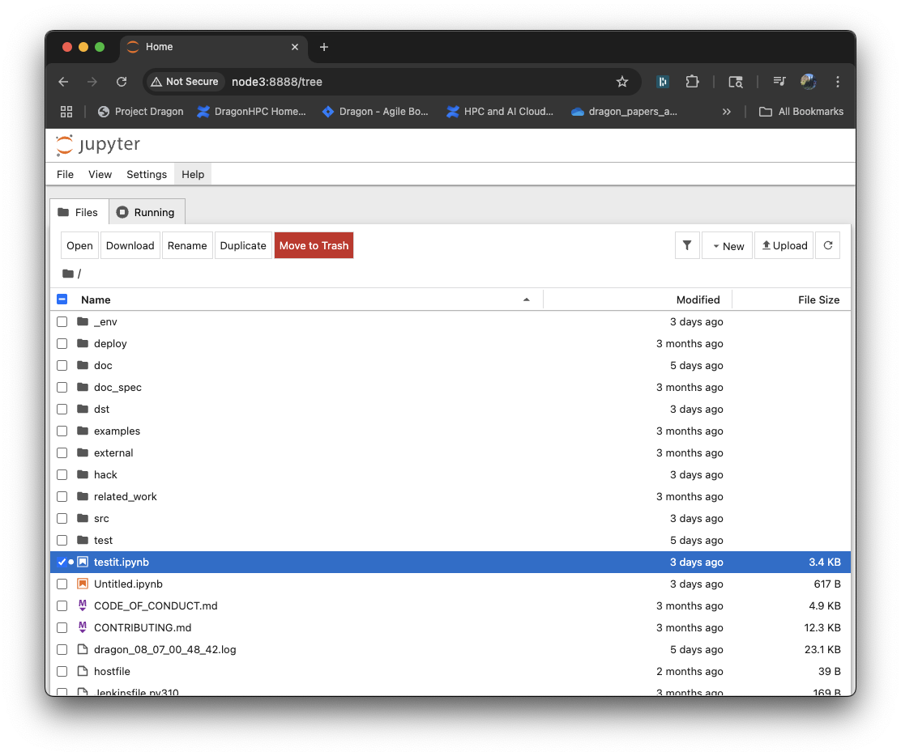

# Running a Jupyter Notebook in Dragon

In this post you learn how to run a Jupyter notebook on a cluster. If you are
familiar with Jupyter notebooks at all, you will know that you cannot do this!
Jupyter runs on a single computer and even though you can use multiprocessing in
your notebook it will only run on the computer where the notebook resides.

Dragon changes this! With Dragon, you can run a Jupyter notebook across an
entire cluster or supercomputer allocation. This may revelutionize the way you
think of a Jupyter notebook and the work you can get done. 

Imagine running a program that takes hours on your laptop. Your jupyter notebook
works, it just takes forever to get your result. Now imagine throwing a bunch of
compute nodes at it that have many more cores than your laptop and that you can
use as many of these nodes as you like. You can get the same work done in a few
minutes. 

A recent (summarized) quote from a user of Dragon, "I think I am falling in love
with Dragon! I was analyzing log files and it was taking forever. With Dragon I
wrote a multiprocessing program and turned it loose on the problem and it was
done in minutes!". 

So how can you do this? First, you pip install Dragon in an environment or
clone the repo and build it as shown in the [Getting
Started](../gettingstarted/README.md) post. 

***Don't forget to activate your environment once you have Dragon set up on your
cluster.***

Then you may want to [watch this
video](https://www.youtube.com/watch?v=-8kXjrCtmFA). Or, you can follow the
directions below. They are pretty simple, so you might save some time just
reading the rest of this post.

You may wish to copy the test Jupyter Notebook for this post onto your cluster.
The [notebook is available here](testit.ipynb).


## A Cluster with a Workload Manager

If you have a cluster with a workload manager, all you need to do to get set up
is to get an allocation on the cluster. Then type

```bash
dragon-jupyter
```

Running that command will start the Jupyter notebook server on your allocation
when you have a workload manager installed on your cluster. You will see some
text printed to the terminal window. You can follow the directions below on your
first Jupyter Notebook with Dragon after you have run this command.

## A Cluster without a Workload Manager

Otherwise, if you have a cluster without a workload manager you will want to do
the following. These directions assume you have a shared filesystem between the
nodes of your cluster. If not, you would need to install Dragon on each node of
the cluster in the same path. Otherwise, NFS will work for a shared filesystem.

First, Make sure that you create a passwordless ssh key and share it among all
the nodes in your cluster. You can google how to do this if you have not done it
before.

Then create a hostfile for yourself. If you have ever used MPI, then this should
not be anything new. But if you have not, the hostfile is very simple. It can be
called **hostfile**. It should look something like this. You can use raw IP
addresses if that's all you have. 

```bash
node0.lan
node1.lan
node2.lan
node3.lan
```

Copy the
[server.py](http://github.com/DragonHPC/dragon/blob/main/src/dragon/jupyter/server.py)
to your directory where you want to run the Jupyter server.

Then to start the Jupyter server you can run the following.

```bash
dragon --hostfile hostfile server.py
```

## Your First Jupyter Notebook

Whether you have a workload manager or not, when you run the proper command
above, you are going to see some text that looks like this:


```bash
(_env) klee@node0:~/home/dragon$ dragon --hostfile hostfile server.py
HSTA binary (/mnt/nfs_home/klee/dragon/src/dragon/bin/dragon-hsta) not available, falling back on TCP transport agent
[I 2025-08-13 00:00:39.755 ServerApp] Extension package jupyter_lsp took 0.1504s to import
[I 2025-08-13 00:00:40.537 ServerApp] jupyter_lsp | extension was successfully linked.
[I 2025-08-13 00:00:40.555 ServerApp] jupyter_server_terminals | extension was successfully linked.
[I 2025-08-13 00:00:40.574 ServerApp] jupyterlab | extension was successfully linked.
[I 2025-08-13 00:00:40.591 ServerApp] notebook | extension was successfully linked.
[I 2025-08-13 00:00:40.595 ServerApp] Writing Jupyter server cookie secret to /home/klee/.local/share/jupyter/runtime/jupyter_cookie_secret
[I 2025-08-13 00:00:41.994 ServerApp] notebook_shim | extension was successfully linked.
[I 2025-08-13 00:00:42.199 ServerApp] notebook_shim | extension was successfully loaded.
[I 2025-08-13 00:00:42.207 ServerApp] jupyter_lsp | extension was successfully loaded.
[I 2025-08-13 00:00:42.211 ServerApp] jupyter_server_terminals | extension was successfully loaded.
[I 2025-08-13 00:00:42.249 LabApp] JupyterLab extension loaded from /mnt/nfs_home/klee/dragon/_env/lib/python3.12/site-packages/jupyterlab
[I 2025-08-13 00:00:42.250 LabApp] JupyterLab application directory is /mnt/nfs_home/klee/dragon/_env/share/jupyter/lab
[I 2025-08-13 00:00:42.253 LabApp] Extension Manager is 'pypi'.
[I 2025-08-13 00:00:42.562 ServerApp] jupyterlab | extension was successfully loaded.
[I 2025-08-13 00:00:42.586 ServerApp] notebook | extension was successfully loaded.
[I 2025-08-13 00:00:42.588 ServerApp] Serving notebooks from local directory: /mnt/nfs_home/klee/dragon
[I 2025-08-13 00:00:42.588 ServerApp] Jupyter Server 2.16.0 is running at:
[I 2025-08-13 00:00:42.588 ServerApp] http://node3:8888/tree?token=f5969b765660f76655a2771fcc7dcaca1e7fa983f7a7446b
[I 2025-08-13 00:00:42.588 ServerApp]     http://127.0.0.1:8888/tree?token=f5969b765660f76655a2771fcc7dcaca1e7fa983f7a7446b
[I 2025-08-13 00:00:42.588 ServerApp] Use Control-C to stop this server and shut down all kernels (twice to skip confirmation).
[C 2025-08-13 00:00:42.604 ServerApp]

    To access the server, open this file in a browser:
        file:///home/klee/.local/share/jupyter/runtime/jpserver-1963-open.html
    Or copy and paste one of these URLs:
        http://node3:8888/tree?token=f5969b765660f76655a2771fcc7dcaca1e7fa983f7a7446b
        http://127.0.0.1:8888/tree?token=f5969b765660f76655a2771fcc7dcaca1e7fa983f7a7446b
[I 2025-08-13 00:00:42.739 ServerApp] Skipped non-installed server(s): bash-language-server, dockerfile-language-server-nodejs, javascript-typescript-langserver, jedi-language-server, julia-language-server, pyright, python-language-server, python-lsp-server, r-languageserver, sql-language-server, texlab, typescript-language-server, unified-language-server, vscode-css-languageserver-bin, vscode-html-languageserver-bin, vscode-json-languageserver-bin, yaml-language-server
```

When you see this, you want to copy the line the line that looks like this into
your browser address bar.

```bash
 http://node3:8888/tree?token=f5969b765660f76655a2771fcc7dcaca1e7fa983f7a7446b
 ```

This will open up the Jupyter server in your browser window and it should look
like this initially.



Depending on your directory structure, you will likely have different files. If
you copied the notebook file earlier, then you will see the testit.ipynb file
in your list of files. If you did not, you can [copy it now](testit.ipynb) or
write it yourself (it's not very big).

Here is your [first Jupyter notebook](testit.ipynb) that will run across an
entire cluster or allocation! 

You should copy this file if you have not to your cluster and run it there with
the directions provided above. When you are done running it, on your browser
window you can select **Shutdown** under the **File** menu to shut the Jupyter
Server down and exit the Dragon program on your cluster. 

That's it. Simple and Powerful. Batteries included!
